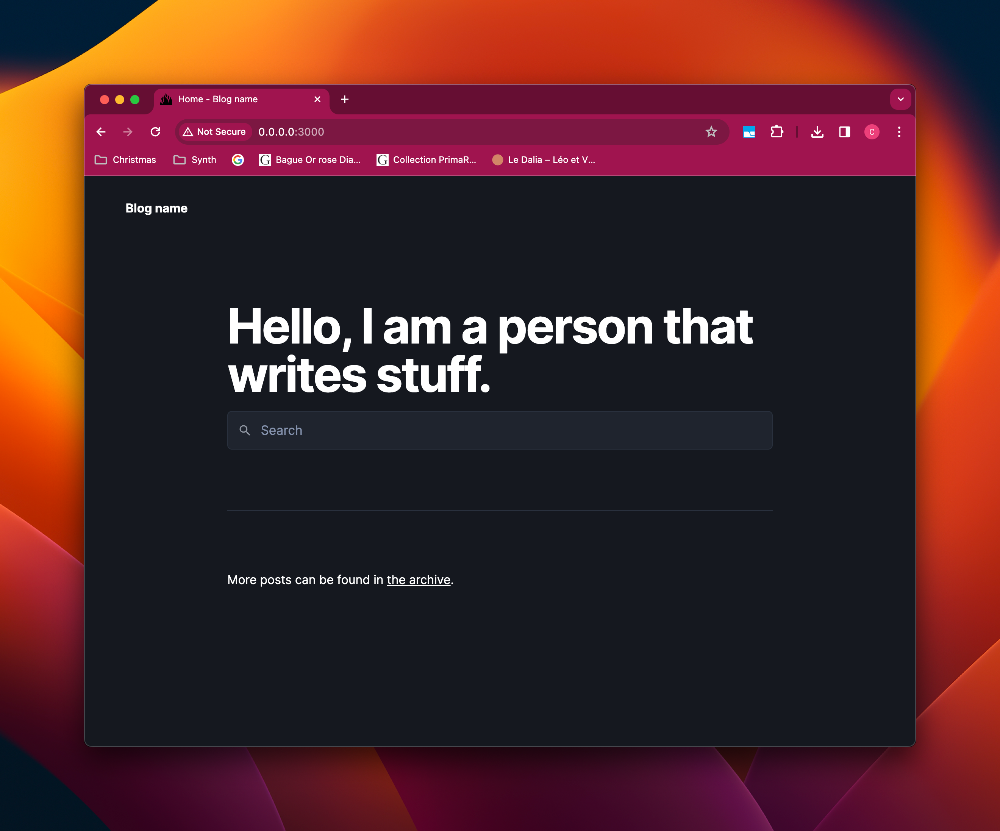
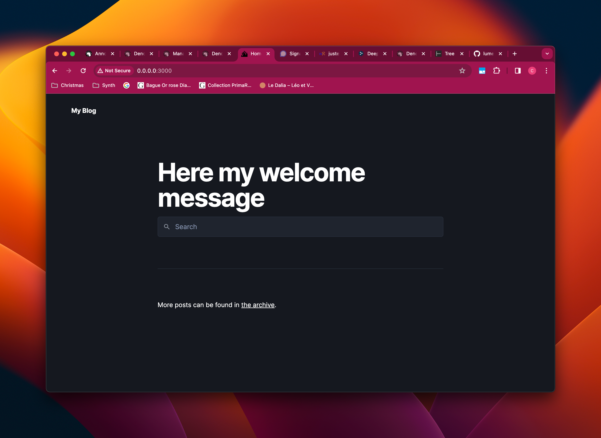
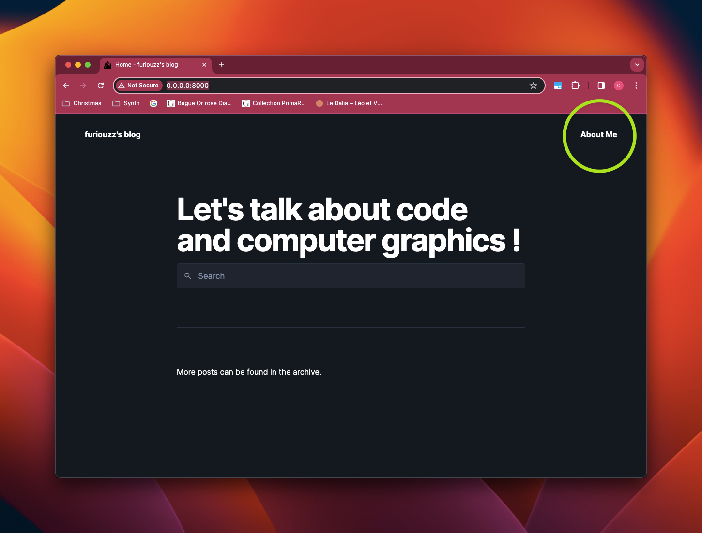
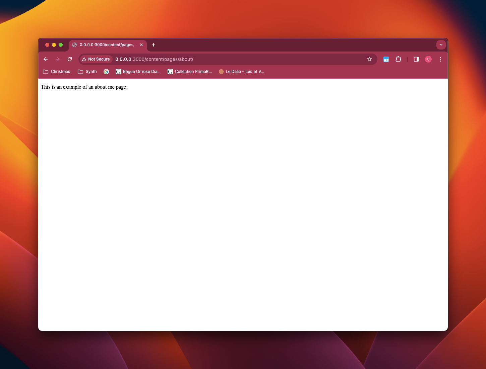
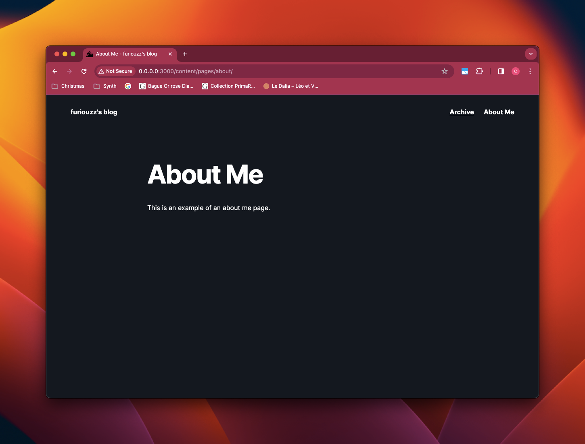
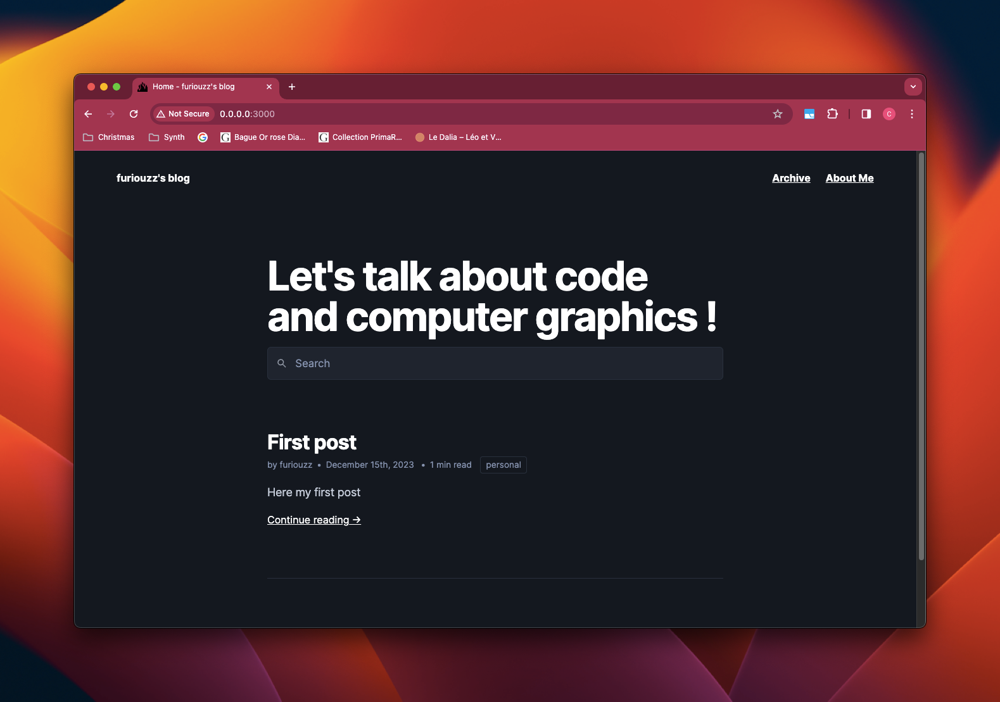
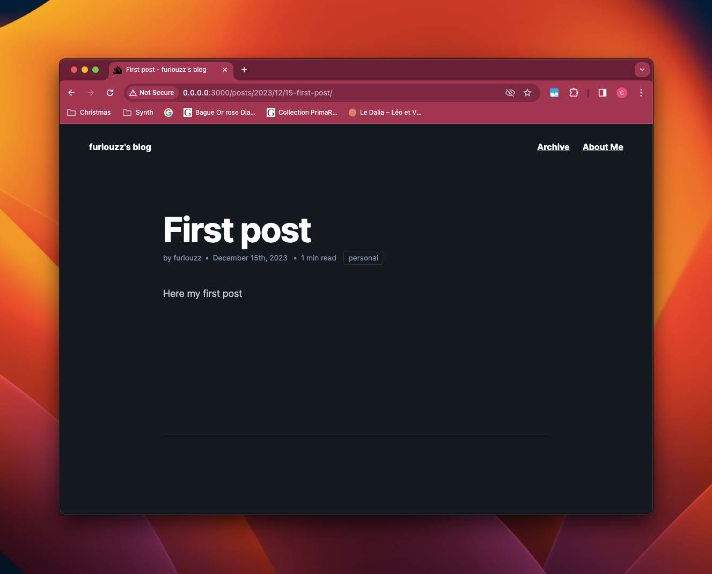

I love tech : spending time in articles reading, codes writing and experiments.
After years of hesitation, I felt the need to share what I learnt and what I experimented.
I wanted to improve my writing skills and discipline myself to writing.
I was looking for a way to express myself and to save my reflexions into a text, an article, a blog.
And there it is : I created a blog. Welcome to my blog !

## What will we talk about?

Blogging of course!

More importantly we will talk about how set up a blog and get it running locally.

To get there, we are going to use:
  * [Deno](https://deno.land/) - a Javascript Runtime easy to use, faster to setup and very powerful
  * [Lume](https://lume.land) - a static site generator using Deno under the wood
  * [Simple Blog](https://github.com/lumeland/theme-simple-blog) - a theme for Lume configured for blogging

Creating a blog is a perfect side project to try these projects.

So in this post, you will learn to:
  * Create the project structure
  * Configure Deno and Lume
  * Start a server locally to see your blog
  * Customize your blog
  * Create a page
  * Share data between multiple pages
  * Create a post

When I created this blog, it was important for me to start writing quickly and not to spend too much time in configuration and customisation. The objective at the end: being focused on writing.

Let's start!

## Create the project structure

Let's create the root directory. Why not call our blog `my-blog`.

Then follow the given directory structure below:

```bash
my-blog/
├── .lume/
│   └── config.ts
├── content/
│   ├── posts/
│   │   └── _data.yml
│   └── pages/
│       └── _data.yml
├── _data.yml
└── deno.json
```

I will explain the role of these directories and files in the next section.

## Setup Lume

Now in this section we will:
  * Install [Deno](https://deno.land)
  * Edit `my-blog/deno.json`
  * Edit `my-blog/.lume/config.ts`
  * Launch Lume server

Remember, in this post, we are not creating a blog from scratch. We want to set it up once and be ready to write.

So we will configure Lume to use [Simple Blog](https://github.com/lumeland/theme-simple-blog) theme.

First you need to install Deno. I invite you to follow the [installation guide](https://docs.deno.com/runtime/manual/getting_started/installation) before going further.

Once this is done, let's edit `my-blog/deno.json`, the Deno configuration file.

```json{data-filename=my-blog/deno.json}
{
  "imports": {
    "lume/": "https://deno.land/x/lume@v2.0.1/",
    "blog/": "https://deno.land/x/lume_theme_simple_blog@v0.10.2/"
  },
  "tasks": {
    "lume": "echo \"import 'lume/cli.ts'\" | deno run --unstable -A - --config .lume/config.ts",
    "build": "deno task lume",
    "serve": "deno task lume -s"
  }
}
```

Let me explain in detail what is written above:
  * The `imports` field is used to configure the [import maps](https://docs.deno.com/runtime/manual/basics/import_maps)
  * The `tasks` field is used to register scripts

Before we start our Lume server locally, we will edit `my-blog/.lume/config.ts`. The configuration is quite simple:

```ts {data-filename=my-blog/.lume/config.ts}
import lume from "lume/mod.ts";
import blog from "blog/mod.ts";

const site = lume({
  dest: ".lume/dist" // Change destination directory
});

site.use(blog()); // Use simple-blog theme

export default site;
```

Ready to see our blog? Open your terminal in your directory, then run:
```bash
deno task serve
```

TADA! Your blog is live (locally) at [http://localhost:3000/](http://localhost:3000/).



## Time for customisation!

Now that our blog works, we will customize it !

Copy [`_data.yml`](https://github.com/lumeland/theme-simple-blog/blob/main/demo/_data.yml) content as explain in [Simple Blog](https://github.com/lumeland/theme-simple-blog/tree/main?tab=readme-ov-file#install-as-a-remote-theme) theme.

Let's edit `my-blog/_data.yml` and copy this content:

```yaml{data-filename=my-blog/_data.yml}
lang: en

home:
  welcome: A very long welcome message to demonstrate how _data files work!

# Metas plugin https://lume.land/plugins/metas/#description
metas:
  site: Here an awesome title!
  description: An example of description
  twitter: "@furiouzz"
  lang: "=lang"
```

As explained in [Simple Blog](https://github.com/lumeland/theme-simple-blog/tree/main?tab=readme-ov-file#install-as-a-remote-theme) and in Lume, `_data.yaml` files are custom data that can be shared by all pages in a directory.

As explained in [Shared data - Lume](https://lume.land/docs/creating-pages/shared-data/), `_data.*` files and `_data` directories are custom data that can be shared by all pages in a directory.

By placing `my-blog/_data.yml` at the root of our directory, we make this data visible on every page of our blog.

Let's see the result on the browser:



## Create a page

To create a page, we will create a markdown file in `my-blog/content/pages` directory.

Let's create an **About** page at `my-blog/content/pages/about.md`:

```markdown{data-filename=my-blog/content/pages/about.md}
---
title: About
---

This is an example of an about me page.
```

You may noticed that file is divided in two parts:
  * The upper part, called *frontmatter*, is where we set (or override) data of your page
  * The bottom part is the content of your page

In our page, we overrided the title with `About` and write some text.

If you go back to your browser, you may notice no change in the homepage.

Simple Blog has a menu which can be enabled by adding the `menu` variable.

Let's edit our file:

```markdown{data-filename=my-blog/content/pages/about.md}
---
title: About
menu:
  visible: true
  order: 2
---

This is an example of an about me page.
```

We made the page visible in the menu and change its index position in the menu.



OK! Now, let's visit our page.



Oh...we lost our CSS. What happened?

In Lume, it is possible to configure a layout by page as explained in the [documentation](https://lume.land/docs/getting-started/create-a-layout/). We need to use a layout to create our page.

Simple Blog has 5 different layouts:
  * `base.vto` - the default layout shared by all layouts
  * `page.vto` - the layout for a page
  * `post.vto` - the layout for a post
  * `archive.vto` - the layout for the archive page
  * `archive_result.vto` - the layout for posts sorted by tags and authors

We need to precise which layout to use by our page.

Again, let's edit our page:

```markdown{data-filename=my-blog/content/pages/about.md}
---
title: "About"
menu:
  visible: true
  order: 2
layout: "layouts/page.vto"
---

This is an example of an about me page.
```

TADA!



## Share data with multiple pages

It will come very repititive to precise the layout for every page. As seen before, you can use the `my-blog/content/pages/_data.yml` to set variables in every page present ins `my-blog/content/pages/`

```yaml{data-filename=my-blog/content/pages/_data.yml}
layout: "layouts/page.vto"
```

We can use the [`basename` variable](https://lume.land/docs/creating-pages/urls/#basename) introduced in Lume 2 called `basename` to remove `/content/` in our URL.

Instead of `/content/pages/about/` the URL will be formatted as `/pages/about/`.

```yaml{data-filename=my-blog/content/pages/_data.yml}
layout: "layouts/page.vto"
basename: "../pages"
```

## Create a post

If you understood the logic, this is quite easy to add post.

Let's create one at `my-blog/content/posts/2023/12/15-first-post.md`:

```markdown {data-filename=my-blog/content/posts/2023/12/15-first-post.md}
---
title: First post
author: furiouzz
tags:
  - personal
---

Here my first post
```

Then edit `my-blog/content/posts/_data.yml` to set default variables for all posts:

```yaml {data-filename=my-blog/content/posts/_data.yml}
layout: layouts/post.vto
basename: ../posts
type: post
```

You may have noticed that we have added a new variable `type`. Simple blog needs this variable to fetch all posts with [Search - Lume](https://lume.land/plugins/search/). Without it, no posts are displayed in your home page.

Now we are ready to see our post and to write something.




## What's next?

Now it's time to write few posts!

In the next post, we will discuss how to deploy our blog with [Deno Deploy](https://deno.land/deploy).

For more information, I invite you to:
* Read [Lume documentation](https://lume.land/docs/overview/about-lume/)
* Fork [theme-simple-blog](https://github.com/lumeland/theme-simple-blog/tree/main)
* Experiment with [Deno](https://deno.com/)

Please, do not hesitate to leave a comment or send me a private message [@furiouzz](https://twitter.com/furiouzz).
