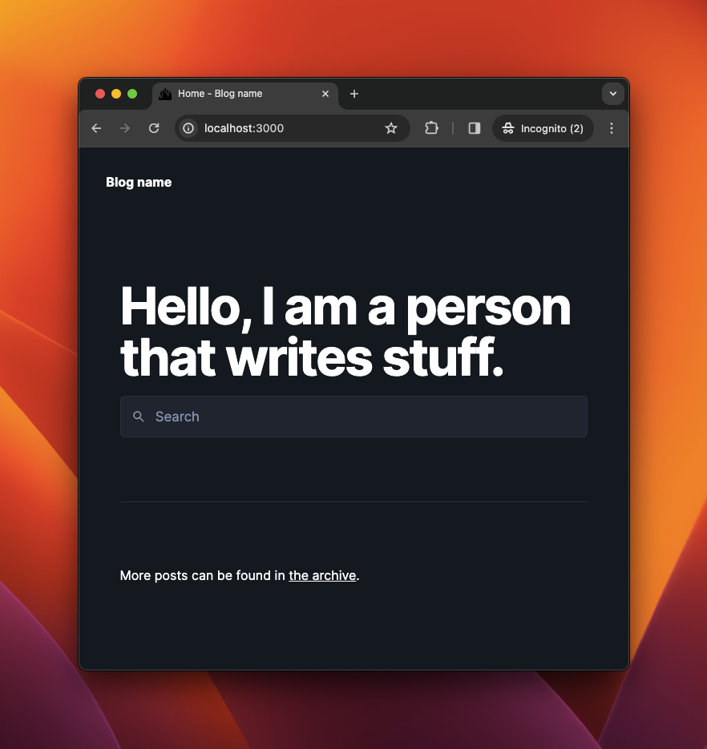
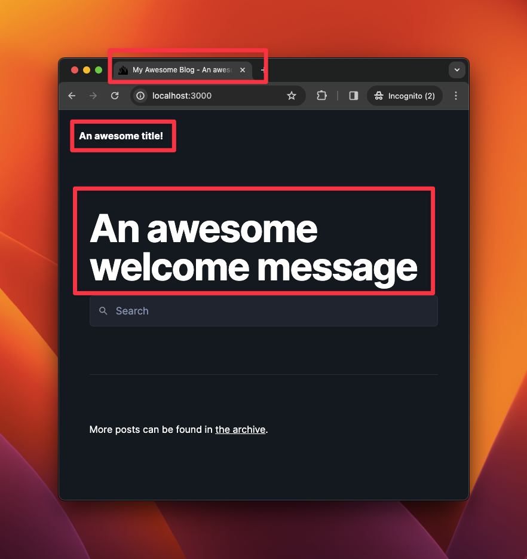
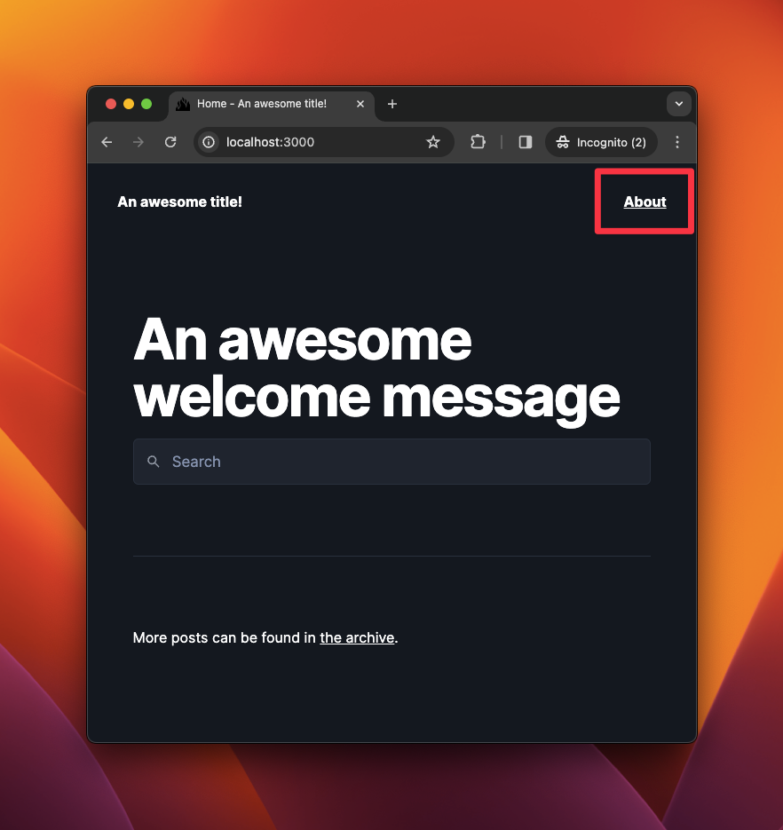
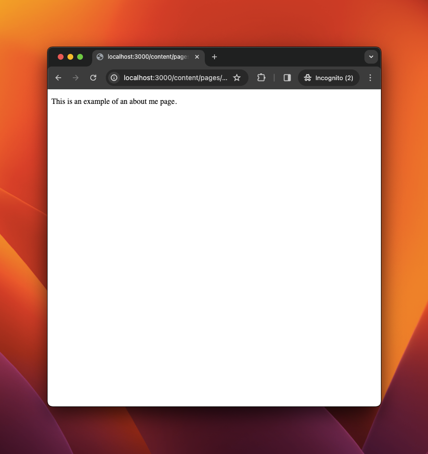
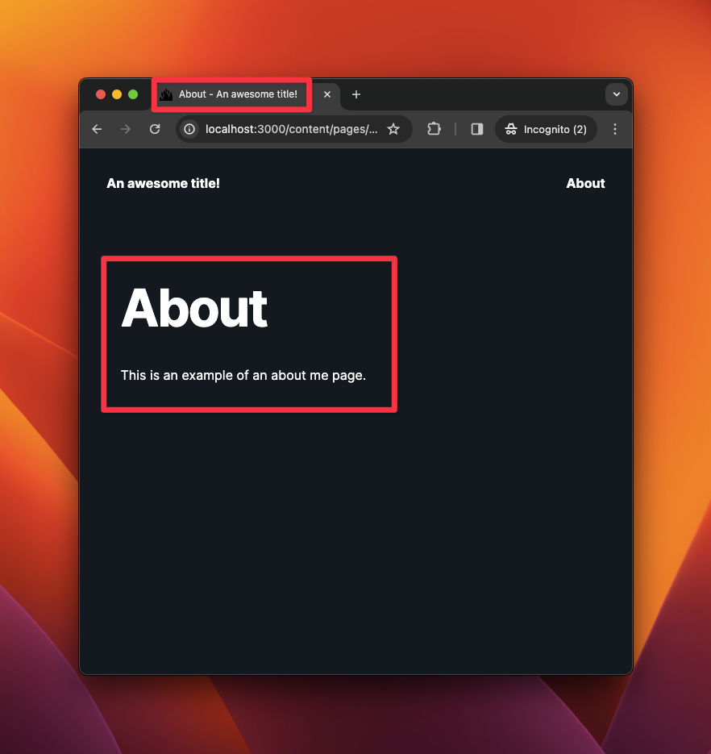
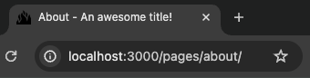
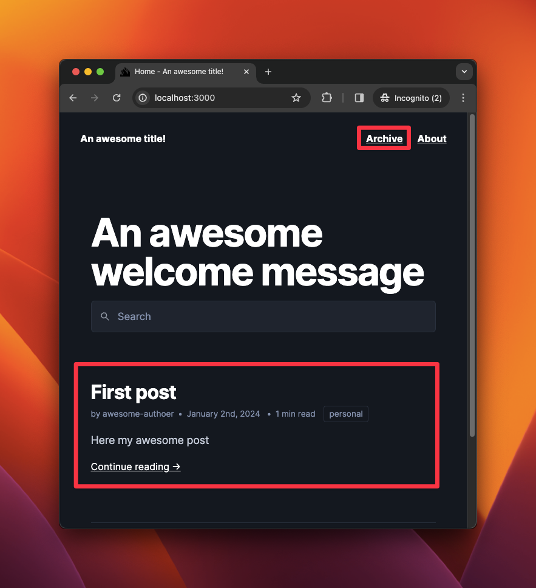
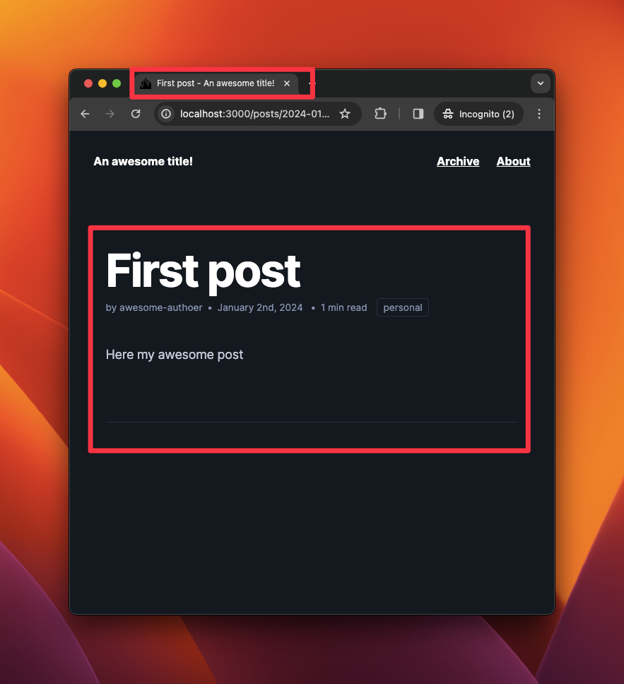

In my spare time, I love reading articles, writing codes and experimenting new concepts. Projects after projects, most of the time, everything falls in forgetting.

For these reasons, I decided to create a blog. I see it as an opportunity to discipline myself into regular writings. I want to organize my thought, improve my writing skills and share my projects.

So, let's start this journey with this first article.

<!-- more -->

## What will we talk about?

Blogging of course! More importantly we will talk about how to set up a blog and get it running locally.

To get there, we are going to use:
  * [Deno](https://deno.land/) - a Javascript runtime easy to use and fast to set up
  * [Lume](https://lume.land) - a static site generator for Deno
  * [Simple Blog](https://github.com/lumeland/theme-simple-blog) - a theme for Lume configured for blogging

Creating a blog is a perfect side project to experiment new technologies.

So in this post, we will:
  * Create project file structure
  * Configure Deno and Lume
  * Start a server locally and have a look at blog
  * Change blog title and welcome message
  * Create a page
  * Share data between multiple pages
  * Create a post

Now that we know where we are going, let's start!

## Create files and directories

In this article, we will call our blog `my-awesome-blog`. Feel free to name it as you want.

In our targeted file structure, we want to focus on creating content and getting less configurations and scripts as possible.

We will create two directories : `.lume/` and `content/`.

Every code and configuration will be inside  `.lume` directory and all articles and pages inside `content` directory.

OK! Create files and directories by following the structure below:

```bash
my-awesome-blog/
├── .lume/
│   └── config.ts
├── content/
│   ├── posts/
│   │   └── _data.yml
│   └── pages/
│       └── _data.yml
├── _data.yml
└── deno.json
```

Details about files will be given later in the article.

## Install Deno and configure Lume

Now, it is time to open your terminal and install [Deno](https://docs.deno.com/runtime/manual/getting_started/installation).

> **What is Deno?**
>
> [Deno](https://deno.land/) is a Javascript Runtime, similar to [Node.js](https://nodejs.org/en) and more recently [Bun](https://bun.sh/). It has many advantages like:
> * Native support for Typescript and JSX
> * Support Web Platform API (like `fetch()` and `localStorage`)
> * Compatible with [Node.js](https://nodejs.org/en) and npm

Once Deno is installed, we will edit `my-awesome-blog/deno.json` file:

```json{label=my-awesome-blog/deno.json}
{
  "imports": {
    "lume/": "https://deno.land/x/lume@v2.0.1/",
    "blog/": "https://deno.land/x/lume_theme_simple_blog@v0.10.2/"
  },
  "tasks": {
    "lume": "echo \"import 'https://deno.land/x/lume@v2.0.1/cli.ts'\" | deno run --unstable -A - --config .lume/config.ts",
    "build": "deno task lume",
    "serve": "deno task lume -s"
  }
}
```

Let me explain what is written above:

* `imports` field is used to configure [import maps](https://docs.deno.com/runtime/manual/basics/import_maps). This is an useful feature inherited from Web API's [importmap](https://developer.mozilla.org/en-US/docs/Web/HTML/Element/script/type/importmap) to control how Deno resolves module specifiers when importing Javascript modules.
* `tasks` field is used to register scripts.

For example, we can rewrite `lume` task this way:

```json{label=my-awesome-blog/deno.json}
{
  "imports": {
    "lume/": "https://deno.land/x/lume@v2.0.1/",
    "blog/": "https://deno.land/x/lume_theme_simple_blog@v0.10.2/"
  },
  "tasks": {
    "lume": "echo \"import 'https://deno.land/x/lume@v2.0.1/cli.ts'\" | deno run --unstable -A - --config .lume/config.ts", // [!code --]
    "lume": "echo \"import 'lume/cli.ts'\" | deno run --unstable -A - --config .lume/config.ts", // [!code ++]
    "build": "deno task lume",
    "serve": "deno task lume -s"
  }
}
```

Now, we will configure Lume. Let's edit `my-awesome-blog/.lume/config.ts`

```ts {label=my-awesome-blog/.lume/config.ts}
import lume from "lume/mod.ts"; // Import "lume"
import blog from "blog/mod.ts"; // Import "theme-simple-blog"

const site = lume({
  dest: ".lume/dist" // Change destination directory
});

site.use(blog()); // Use "theme-simple-blog"

export default site;
```

As explained before we can directly import Lume with `import lume from "lume/mod.ts"` and Simple Blog theme with `import blog from "blog/mod.ts"` instead of writing the entire url thanks to `imports` field.

OK! Open your terminal in your `my-awesome-blog` directory, then run:
```bash
$ deno task serve
```

TADA! Your blog is running (locally) at [http://localhost:3000/](http://localhost:3000/).

{transform-images="avif webp jpg 800@2"}

## Change title and welcome message

Let's customize this blog with some content.

As you may have noticed, we use [Simple Blog theme](https://github.com/lumeland/theme-simple-blog/) maintained by Lume creator. To customize this theme, we have to create `_data.yml` file at the root of our blog directory.

Let's edit `my-awesome-blog/_data.yml`;

```yaml{label=my-awesome-blog/_data.yml}
lang: en

home:
  welcome: Hello, I am a person who writes stuff.

extra_head:

# Metas plugin https://lume.land/plugins/metas/#description
metas:
  site: Blog example
  description: This is an example of a Lume blog theme
  twitter: "@misteroom"
  lang: "=lang"
```

If you refresh your browser, you have noticed that nothing changed.

> **What is this `_data.yml` file?**
>
> This file stores custom data shared by all pages in a directory. As explained in [Lume Documentation](https://lume.land/docs/creating-pages/shared-data/), this file can be a `.yml`, `.json`, `.js` or `.ts`. It can even be a directory `_data` containing files.

**Simple Blog theme** uses a specific [data structure](https://github.com/lumeland/theme-simple-blog/blob/main/demo/_data.yml) to customize the theme.

Let's edit this file again::

```yaml{label=my-awesome-blog/_data.yml}
lang: en

title: My Awesome Blog # [!code ++]

home:
  welcome: Hello, I am a person that writes stuff. # [!code --]
  welcome: An awesome welcome message # [!code ++]

# Metas plugin https://lume.land/plugins/metas/#description
metas:
  site: Blog example # [!code --]
  site: An awesome title! # [!code ++]
  description: This is an example of a Lume blog theme # [!code --]
  description: An awesome description # [!code ++]
  twitter: "@awesomeuser"
  lang: "=lang"
```

Refresh and see:

{transform-images="avif webp jpg 800@2"}

## Create our first page

Let's create an **About** page at `my-awesome-blog/content/pages/about.md` and write some text.

```markdown{label=my-awesome-blog/content/pages/about.md}
---
title: About
---

This is an example of an about me page.
```

This file is divided in two parts:
  * The upper part is called **frontmatter**. This is where we set [Page data](https://lume.land/docs/creating-pages/page-data/)
  * The bottom part is the **content of our page** written in markdown

> **Page Data**
>
> Similar to `_data.yml`, [Page data](https://lume.land/docs/creating-pages/page-data/) is custom data assigned to a page.
>
> Instead of writing data in the **frontmatter**, you can write it in a separate file matching the page name with an extension `.yml`, `.json`, `.ts` or `.js`.
>
> eg.: with `about.md` you can create `about.yml`.

Well, We are not ready to see our page yet. You may have noticed that we cannot access our page from the home page.

Simple Blog has a menu which can be enabled by adding the `menu` object property.

Let's edit our file:

```markdown {label=my-awesome-blog/content/pages/about.md}
---
title: About
menu:           # [!code ++]
  visible: true # [!code ++]
---

This is an example of an about me page.
```

We made the page visible in the menu.

{transform-images="avif webp jpg 800@2"}

OK! Now, let's visit our page.

{transform-images="avif webp jpg 800@2"}

Oh...What happened?

In [Lume Documentation](https://lume.land/docs/getting-started/create-a-layout/), we can configure a layout by page.

Simple Blog has [5 layouts](https://github.com/lumeland/theme-simple-blog/tree/e1a0146f392890d9af28f3cf43e4749030cc6556/src/_includes/layouts):
  * `base.vto` - the default layout shared by all layouts
  * `page.vto` - the layout for a page
  * `post.vto` - the layout for a post
  * `archive.vto` - the layout for the archive page
  * `archive_result.vto` - the layout for posts sorted by tags and authors

For example if we visit the [Simple Blog theme](https://github.com/lumeland/theme-simple-blog/) repository, we may notice that our home page is represented by [src/index.vto](https://github.com/lumeland/theme-simple-blog/blob/e1a0146f392890d9af28f3cf43e4749030cc6556/src/index.vto#L2). This page uses `base.vto` layout.

> In [Lume](https://lume.land/docs/creating-pages/page-files/), a page can use different format like `.md`, `.js`, `.ts`. You can even write your page in HTML `.html` or use a template engine like Vento `.vto`.

We did not specify a layout to our page. We need to set which one to use. Again, let's edit our page:

```markdown {label=my-awesome-blog/content/pages/about.md}
---
title: "About"
menu:
  visible: true
layout: "layouts/page.vto" # [!code ++]
---

This is an example of an about me page.
```

TADA!

{transform-images="avif webp jpg 800@2"}

## Share data with multiple pages

Having to set the layout for every page will become a very repetitive task. Our solution is (as we have seen before), to use [Shared data](https://lume.land/docs/creating-pages/shared-data/) to set defaults properties for every page in a directory.

We have already prepared that file at `my-awesome-blog/content/pages/_data.yml`.

Let's edit our files:

```markdown {label=my-awesome-blog/content/pages/about.md}
---
title: "About"
menu:
  visible: true
layout: "layouts/page.vto" # [!code --]
---
```
And edit `my-awesome-blog/content/pages/_data.yml`:
```yaml{label=my-awesome-blog/content/pages/_data.yml}
layout: "layouts/page.vto" # [!code ++]
```

Because I prefer beautiful URLs, I suggest that we use the [basename](https://lume.land/docs/creating-pages/urls/#basename) property to remove `/content/` from our URL.

Instead of `/content/pages/about/` the URL will be formatted as `/pages/about/`.

```yaml{label=my-awesome-blog/content/pages/_data.yml}
layout: "layouts/page.vto"
basename: "../pages" # [!code ++]
```

We are getting there!

<div style="justify-content: center; display: flex;">

{transform-images="avif webp jpg 400@2"}

</div>

## Create our first post

At this time, it should be easy to create a post.

Let's create one:

```markdown{label=my-awesome-blog/content/posts/2024-01-01.md}
---
title: First post
author: furiouzz
tags:
  - personal
---

Here my first post
```

Then edit `my-awesome-blog/content/posts/_data.yml` to set default variables for all posts:

```yaml{label=my-awesome-blog/content/posts/_data.yml}
layout: layouts/post.vto
basename: ../posts
type: post
```

You may have noticed that we added a new property `type`. Simple Blog theme needs this property to differentiate `post` from `page`. Without it, no posts will be displayed on your homepage.

Once you have refreshed your homepage, you will notice two things: your freshly created post and also the `Archives` item in the menu.

{transform-images="avif webp jpg 800@2"}

Now, look at the title and content of your first post:

{transform-images="avif webp jpg 800@2"}

## What's next?

In the next post, we will discuss how to deploy our blog with [Deno Deploy](https://deno.land/deploy).

For more information, I invite you to:
* Read [Lume documentation](https://lume.land/docs/overview/about-lume/)
* Fork [theme-simple-blog](https://github.com/lumeland/theme-simple-blog/tree/main)
* Experiment with [Deno](https://deno.com/)

Please, do not hesitate to leave a comment or send me a private message [@furiouzz](https://twitter.com/furiouzz).
