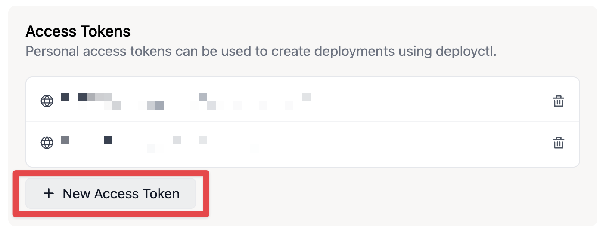

Last month we talked about [how to create a blog with Deno and Lume](./how-to-create-a-blog-with-deno-and-lume). It is now time to discuss about how to make it accessible publicly.

<!-- more -->

[Lume](https://lume.land) is a static site generator, it can generates files for our blog. But we still need a couple of steps to deploy these files on a server. Lume has an interesting [Deployment section](https://lume.land/docs/advanced/deployment/) for deployment on most popular services, including [Deno Deploy](https://deno.com/deploy).

In this post, we will see step-by-step the deployment of our blog on Deno Deploy and use On-demand plugin.

Here the plan:
  * Create a project on Deno Deploy
  * Create a workflow for Github Actions
  * Setup [On demand plugin](https://lume.land/plugins/on_demand/) plugin

## File architecture

To deploy our blog we need to:
* Edit `.lume/entrypoint.ts`
* Update `deno.json` with deployment configuration
* Install [`deployctl`](https://docs.deno.com/deploy/manual/deployctl#install-deployctl), a command-line for interacting with Deno Deploy platform
* Automate deployment with Github Actions

If we take the targeted file sturcture from our [previous blog post](./how-to-create-a-blog-with-deno-and-lume), we will create three more files: `.lume/entrypoint.ts` and `.github/workflows/deploy.yml`.

```bash
my-awesome-blog/
├── .github/
│   └── workflows/
│   │   └── deploy.yml # [!code ++]
├── .lume/
│   ├── entrypoint.ts # [!code ++]
│   └── config.ts
├── content/
│   ├── posts/
│   │   ├── _data.yml
│   │   └── 2024-01-01.md
│   └── pages/
│       ├── _data.yml
│       └── about.md
├── .env # [!code ++]
├── _data.yml
└── deno.json
```

::: quote warning
Do not forget to add `.env` and `_site` to your `.gitignore` file.
:::

## First deployment

Let's start with our entrypoint. We want to serve `.lume/site/` directory:

```ts {label=my-awesome-blog/.lume/entrypoint.ts}
import Server from "https://deno.land/x/lume@v2.0.2/core/server.ts";

const port = 8000;

const server = new Server({
  root: `${Deno.cwd()}/.lume/_site`,
  port,
})

server.start();

console.log(`Listening on http://localhost:${port}`);
```

Now, we need to configure the deployment:

```json {label=my-awesome-blog/deno.json}
{
  "imports": {
    "lume/": "https://deno.land/x/lume@v2.0.1/",
    "blog/": "https://deno.land/x/lume_theme_simple_blog@v0.10.2/"
  },
  "deploy": { // [!code ++]
    "project": "my-awesome-blog", // [!code ++]
    "exclude": [ // [!code ++]
      "**/node_modules" // [!code ++]
    ], // [!code ++]
    "include": [ // [!code ++]
      "./.lume/entrypoint.ts", // [!code ++]
      "./.lume/_site" // [!code ++]
    ], // [!code ++]
    "entrypoint": ".lume/entrypoint.ts" // [!code ++]
  }, // [!code ++]
  "tasks": {
    "deploy": "deno run --env -A https://deno.land/x/deploy@1.10.0/deployctl.ts deploy", // [!code ++]
    "lume": "echo \"import 'lume/cli.ts'\" | deno run --unstable -A - --config .lume/config.ts",
    "build": "deno task lume",
    "serve": "deno task lume -s"
  }
}
```

::: quote
What is [Deno Deploy](https://deno.com/deploy) ? This is a service for hosting Javascript application. Your application is hosted on server geographically close to your users, which enable low latency and fast response times.
:::

::: quote warning
At the time we are writing, you need a Github account to use Deno Deploy. On the other hand, you can host your source code wherever you want.
:::

Let's generate our access token. Go to [account settings](https://dash.deno.com/account#access-tokens), then look for **Access tokens** section. Click on **New Access Token**.

{transform-images="avif webp jpeg 800@2"}

Once generated, copy your token and add it to `.env` file:

```ini {label=my-awesome-blog/.env}
DENO_DEPLOY_TOKEN=YOUR_ACCESS_TOKEN_HERE
```

We are ready, let's execute our first deployment:

```bash
$ DENO_DEPLOY_TOKEN=YOUR_ACCESS_TOKEN_HERE deno task deploy
```

Tada :tada:! Your blog is deployed.

After the command execution, you may have an output similar to the one below:

```bash
✔ Production deployment complete.
✔ Updated config file '/workspaces/my-awesome-blog/deno.json'.

View at:
 - https://my-awesome-blog-DEPLOYMENT_ID.deno.dev
```

## Automate deployment

We can automate the deployment thanks to Github Actions.

We want to deploy in production when a commit is pushed to `main` and we want to deploy in preview when a commit is pushed to a branch targeting `main` in a pull request (PR).

Before that, we need to give your access token to your workflow. Go to [Actions secrets and variables](https://github.com/FuriouZz/blog/settings/secrets/actions) of your Github repository, click on `New repository secret`. Specify `DENO_DEPLOY_TOKEN` as the name and set your access token as the value, then press `Add secret`.

We are now ready to write on `deploy.yml`:

```yml {label=my-awesome-blog/.github/workflows/deploy.yml}
name: Deploy

on:
  # Triggered when you push to `main`
  # Our blog will be published in your production url
  push:
    branches:
      - main

  # Triggered when you have to PR pointing to main.
  # Our blog will be publised in your preview url
  pull_request:
    branches:
      - main

jobs:
  # Job for generating .lume/_site directory and its files
  build:
    name: Build
    runs-on: ubuntu-latest

    steps:
      - name: Clone repository
        uses: actions/checkout@v3

      - name: Install Deno
        uses: denoland/setup-deno@v1
        with:
          deno-version: v1.x

      # Execute our build command
      - name: Build
        run: deno task build

      - name: Archive Production Artifact
        uses: actions/upload-artifact@master
        with:
          name: _site
          path: .lume/_site/

  # Job for deploying .lume/_site
  deploy:
    name: Deploy
    needs: build
    runs-on: ubuntu-latest

    steps:
      - name: Clone repository
        uses: actions/checkout@v3

      - name: Install Deno
        uses: denoland/setup-deno@v1
        with:
          deno-version: v1.x

      - name: Download Artifact
        uses: actions/download-artifact@master
        with:
          name: _site
          path: .lume/_site/

      # Execute our deploy command
      - name: Upload to Deno Deploy
        env:
          DENO_DEPLOY_TOKEN: ${{ secrets.DENO_DEPLOY_TOKEN }} # Set DENO_DEPLOY_TOKEN environment variable
        run: deno task deploy ${{ endsWith(github.ref, '/main') && '--prod' || '' }}
```

You may have noticed that we added `${{ endsWith(github.ref, '/main') && '--prod' || '' }}` to our `deploy` task.

In our first deployment, you may have noticed that `deployctl` created two URLs: one for **preview** and the other one for **production**.

Now, each time we call `deno task deploy` our blog will be published in **preview** by default. If you want to publish in **production**, we need to add `--prod`.

With `${{ endsWith(github.ref, '/main') && '--prod' || '' }}` we are saying to add `--prod` only when the workflow is triggered by the `main` branch. It means only when a commit is pushed to `main` branch.
