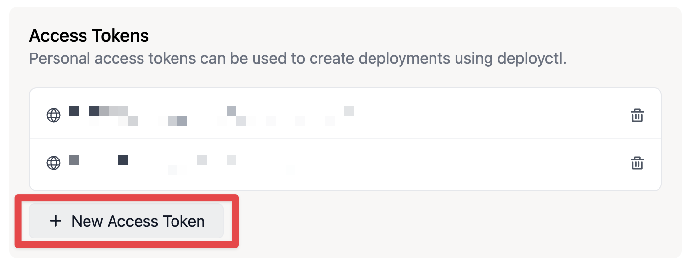
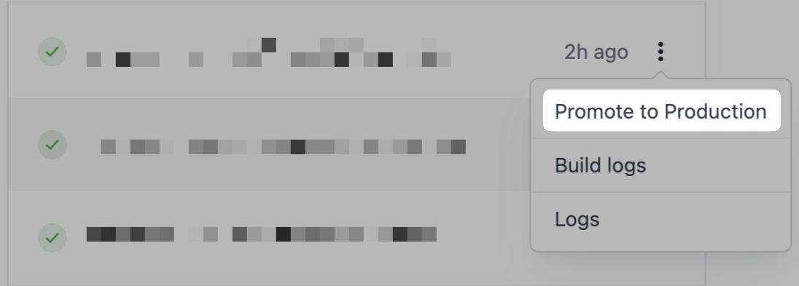
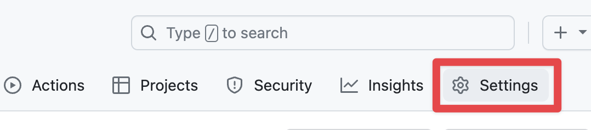
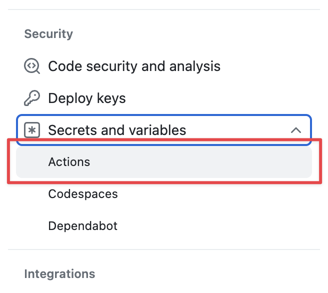
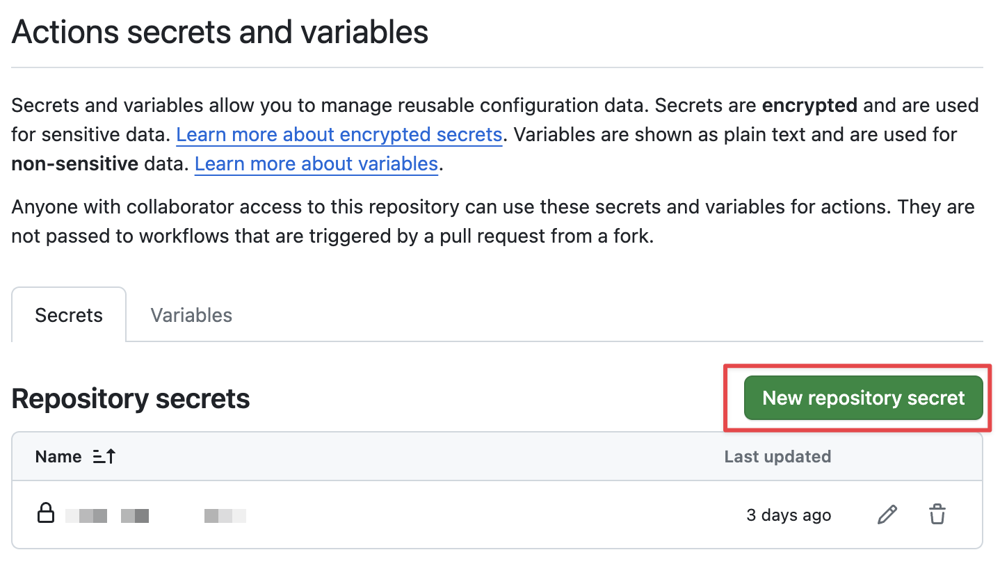
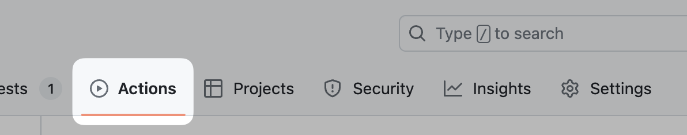
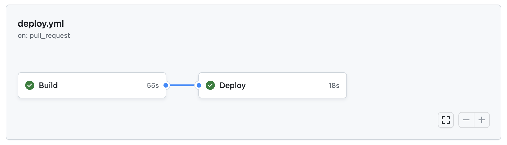

In a [previous post](/posts/how-to-create-a-blog-with-deno-and-lume), we talked about how to create a blog with [Deno](https://deno.com/) and [Lume](https://lume.land/). In this post, we will make it accessible publicly with [Deno Deploy](https://deno.com/deploy).

<!-- more -->

To follow this post, you need a file structure similar to the one created in the section [Create files and directories](/posts/how-to-create-a-blog-with-deno-and-lume#create-files-and-directories). Let me remind you how it looks like:

```bash
my-awesome-blog/
├── .lume/
│   └── config.ts
├── content/
│   ├── posts/
│   │   ├── _data.yml
│   │   └── 2024-01-01.md
│   └── pages/
│       ├── _data.yml
│       └── about.md
├── _data.yml
└── deno.json
```

I used [Lume](https://lume.land), a static site generator, to generate our blog. So I have configured our `deno.json` file with frequently used scripts into the `tasks` field and our necessary libraries into the `imports` field.

```json{label=my-awesome-blog/deno.json}
{
  "imports": {
    "lume/": "https://deno.land/x/lume@v2.0.1/",
    "blog/": "https://deno.land/x/lume_theme_simple_blog@v0.10.2/"
  },
  "tasks": {
    "lume": "echo \"import 'lume/cli.ts'\" | deno run --unstable -A - --config .lume/config.ts",
    "build": "deno task lume",
    "dev": "deno task lume -s"
  }
}
```

Our objective is to run a web server which will serve the directory `.lume/_site`, produced by the `build` task. The server will be deployed to [Deno Deploy](https://deno.com/deploy).

::: quote
**What is Deno Deploy?**

[Deno Deploy](https://deno.com/deploy) is a service for hosting Javascript application. Your application is hosted on server geographically close to your users, which enable low latency and fast response times.

Deno Deploy has a [free plan](https://deno.com/deploy/pricing) for side-project, like a blog.
:::

Lume has an interesting [Deployment section](https://lume.land/docs/advanced/deployment/) for deployment on most popular services, including Deno Deploy. However we will not follow the [Deno Deploy section](https://lume.land/docs/advanced/deployment/#deno-deploy) because it uses a [Github action](https://github.com/denoland/deployctl/tree/main/action).

For this post, I prefer to use [deployctl](https://github.com/denoland/deployctl), a command line for Deno Deploy. Even if we will use Github Actions as our CI/CD tool, it will be easier to adapt the [automation section](#automate-deployment) to your CI/CD pipeline.

> CI/CD stands for Continuous Integration and Continuous Delivery/Deployment.

::: quote warning
As of January 2024, Deno Deploy use Github as its primary integration. You need a Github account to connect to Deno Dashboard.
:::

Here is the plan:
1. Update your file architecture
2. Launch your first deployment
3. Automate deployment with a CI/CD pipeline

## File architecture

In our targeted file architecture, we will create two new files:
* `.lume/entrypoint.ts`, the script executed by Deno Deploy
* `.github/workflows/deploy.yml` , the Github workflow for site generation and deployment

```bash
my-awesome-blog/
├── .github/
│   └── workflows/
│   │   └── deploy.yml # [!code ++]
├── .lume/
│   ├── entrypoint.ts # [!code ++]
│   └── config.ts
├── content/
│   ├── posts/
│   │   ├── _data.yml
│   │   └── 2024-01-01.md
│   └── pages/
│       ├── _data.yml
│       └── about.md
├── _data.yml
└── deno.json
```

## First deployment

Take the following steps to configure [deployctl](https://github.com/denoland/deployctl):
1. Setup `.lume/entrypoint.ts`
2. Create a `deploy` task in `deno.json`
3. Add deployment configuration in `deno.json`
4. Generate an access token on Deno Dashboard

Let's start with our entrypoint. The entrypoint will start a web server and will serve `.lume/_site/` directory.

Edit `.lume/entrypoint.ts`:

```ts {label=my-awesome-blog/.lume/entrypoint.ts}
import Server from "https://deno.land/x/lume@v2.0.2/core/server.ts";

const server = new Server({
  root: `${Deno.cwd()}/.lume/_site`,
  port: 8000,
})

server.start();
```

Let's add a task `preview` to run the `.lume/entrypoint.ts`:

```json {label=my-awesome-blog/deno.json}
{
  "imports": {
    "lume/": "https://deno.land/x/lume@v2.0.1/",
    "blog/": "https://deno.land/x/lume_theme_simple_blog@v0.10.2/"
  },
  "tasks": {
    "lume": "echo \"import 'lume/cli.ts'\" | deno run --unstable -A - --config .lume/config.ts",
    "build": "deno task lume",
    "preview": "deno run -A .lume/entrypoint.ts", // [!code ++]
    "dev": "deno task lume -s"
  }
}
```

::: quote
The `preview` task mainly exists for testing your server locally. Deno Deploy will run `.lume/entrypoint.ts` by itself.
:::

Now run these commands below to build and serve your blog at [http://localhost:8000/](http://localhost:8000/):

```bash
$ deno task build
$ deno task preview
```

Now we will add a `deploy` task and a new `deploy` field for configuration.

The new `deploy` field will contains following configurations:
* `project` is the name of your project. It can be whatever you want.
* `entrypoint` targets the script file executed by Deno Deploy.
* `include` lists files and directories to be deployed.
* `exclude` lists files and directories to not be deployed.

```json {label=my-awesome-blog/deno.json}
{
  "imports": {
    "lume/": "https://deno.land/x/lume@v2.0.1/",
    "blog/": "https://deno.land/x/lume_theme_simple_blog@v0.10.2/"
  },
  "deploy": { // [!code ++]
    "project": "YOUR_PROJECT_NAME", // [!code ++]
    "entrypoint": ".lume/entrypoint.ts", // [!code ++]
    "include": [ // [!code ++]
      "./.lume/entrypoint.ts", // [!code ++]
      "./.lume/_site" // [!code ++]
    ], // [!code ++]
	"exclude": [ // [!code ++]
      "**/node_modules" // [!code ++]
    ] // [!code ++]
  }, // [!code ++]
  "tasks": {
    "deploy": "deno run --env -A https://deno.land/x/deploy@1.10.3/deployctl.ts deploy", // [!code ++]
    "lume": "echo \"import 'lume/cli.ts'\" | deno run --unstable -A - --config .lume/config.ts",
    "build": "deno task lume",
    "preview": "deno run -A .lume/entrypoint.ts",
    "dev": "deno task lume -s"
  }
}
```

::: quote warning
Pay attention to the `YOUR_PROJECT_NAME` value. You must replace it with your own project name or remove this line. If you choose to remove the line, Deno Deploy will generate a name for you and will set the `project` field with the project id.
:::

Here is our last step. Go to [account settings](https://dash.deno.com/account#access-tokens), then look for **Access tokens** section. Click on **New Access Token** button.

{transform-images="avif webp jpg 800@2"}

Once generated, run the command below with your access token:

```bash
$ export DENO_DEPLOY_TOKEN=YOUR_ACCESS_TOKEN
```

Now we are ready to launch your first deployment:

```bash
$ deno task deploy
```

Tada :tada:! Your blog is deployed.

You have an output similar to the one below:

```bash
✔ Production deployment complete.
✔ Updated config file '/workspaces/my-awesome-blog/deno.json'.

View at:
 - https://YOUR_PROJECT_NAME-DEPLOYMENT_ID.deno.dev
 - https://YOUR_PROJECT_NAME.deno.dev
```

Let me explain these lines:
* This is our first deployment, so Deno Deploy deploy to production by default.
* If you omitted the `project` field, your `deno.json` has been updated with the `project` field setted.
* You can visit your application at two URLs: the **preview** URL and the **production** URL.

As it is our first deployment, the two URLs target the same deployment specified by `DEPLOYMENT_ID`. If you run the `deploy` task a second time, you only have the preview URL with a different `DEPLOYMENT_ID`.

To promote a deployment to **production**, you have to specify the `--prod` flag.

```bash
$ deno task deploy --prod
```

Now `https://YOUR_PROJECT_NAME.deno.dev` targets the new deployment.

::: quote warning
At the moment, only new deployment can be promoted to **production** with `deployctl`.

If you want to promote a specific deployment, you have to:
* Connect to the [Deno Dashboard](https://dash.deno.com/)
* Go to **Projects** and select your project
* Go to **Deployments**
* Click on the **three dot icon** near the deployment you want to promote

{transform-images="avif webp jpg 800@2"}
:::

## Automate deployment

To automate our deployment, we will create a CI/CD pipeline with Github workflow.

We will apply the follwing rules to our workflow:
* When we push to the `main` branch, the deployment is promoted to **production**.
* When we push to a pull request targeting the `main` branch, the deployment is promoted to **preview**.

We will follow these steps to setup our Github workflow:
1. Add our access token into a secret
2. Configure workflow triggers
3. Create a `build` job for site generation
4. Create a `deploy` job for deployment

First, let's add our secret!

Click on **Settings**, the button is placed in the navigation bar of your repository.

{transform-images="avif webp jpg 800@2"}

On the sidebar on the left, look for the **Security** section, unfold **Secrets and variables** and click on **Actions**.

{transform-images="avif webp jpg 400@2" width="100%" height="300" style="object-fit: contain;"}

Click on `New repository secret`.

{transform-images="avif webp jpg 400@2" width="100%" height="300" style="object-fit: contain; object-position: center"}

Specify `DENO_DEPLOY_TOKEN` in the name field and set your access token in the value field. Then click on the `Add secret` button.

Now let's edit `github/workflows/deploy.yml`:

```yml {label=my-awesome-blog/.github/workflows/deploy.yml}
name: Deploy

on:
  # Triggered when you push to `main`
  push:
    branches:
      - main

  # Triggered when you have to PR pointing to main
  pull_request:
    branches:
      - main
```

Now let's create our first `build` job:

```yml {label=my-awesome-blog/.github/workflows/deploy.yml}
name: Deploy

on:
  # (truncated...)

jobs:
  # Job for generating .lume/_site directory and its files
  build:
    name: Build
    runs-on: ubuntu-latest

    steps:
      - name: Clone repository
        uses: actions/checkout@v4

      - name: Install Deno
        uses: denoland/setup-deno@v1
        with:
          deno-version: v1.x

      - name: Build
        run: deno task build

      - name: Archive _site Artifact
        uses: actions/upload-artifact@master
        with:
          name: _site
          path: .lume/_site/
```

Then let's create our second `deploy` job, executed after the `build` job. This job will promote the deployment to **production** only when we push to the `main` branch:

```yml {label=my-awesome-blog/.github/workflows/deploy.yml}
name: Deploy

on:
  # (truncated...)

jobs:
  # Job for generating .lume/_site directory and its files
  build:
    # (truncated...)

  # Job for deploying .lume/_site
  deploy:
    name: Deploy
    needs: build
    runs-on: ubuntu-latest

    steps:
      - name: Clone repository
        uses: actions/checkout@v4

      - name: Install Deno
        uses: denoland/setup-deno@v1
        with:
          deno-version: v1.x

      - name: Download Artifact
        uses: actions/download-artifact@master
        with:
          name: _site
          path: .lume/_site/

      - name: Upload to Deno Deploy
        env:
          DENO_DEPLOY_TOKEN: ${{ secrets.DENO_DEPLOY_TOKEN }}
        run: deno task deploy ${{ endsWith(github.ref, '/main') && '--prod' || '' }}
```

Push your changes, click on `Actions` tab of your repository

{transform-images="avif webp jpg 400@2" width="100%" height="150" style="object-fit: contain;"}

then check your deployment.

{transform-images="avif webp jpg 400@2" width="100%" height="220" style="object-fit: contain;"}

## Create a PR comment

Now it would be interesting to create to our PR with our deployment URLs.

To create this comment, we will create another step with some Javascript code. Also, we need to edit our deployment step to catch the `STDOUT` of our command.

For that, we will use two more actions:
* [mathiasvr/command-output](https://github.com/mathiasvr/command-output) will expose the `STDOUT` of our command.
* [actions/github-script](https://github.com/actions/github-script) will execute a Javascript without the `STDOUT` content and create a PR comment.

```yml {label=my-awesome-blog/.github/workflows/deploy.yml}
name: Deploy

on:
  # (truncated)

jobs:
  # Job for generating .lume/_site directory and its files
  build:
    # (truncated)

  # Job for deploying .lume/_site
  deploy:
    name: Deploy
    needs: build
    runs-on: ubuntu-latest

    steps:
      - name: Clone repository
        uses: actions/checkout@v4

      - name: Install Deno
        uses: denoland/setup-deno@v1
        with:
          deno-version: v1.x

      - name: Download Artifact
        uses: actions/download-artifact@master
        with:
          name: _site
          path: .lume/_site/

      - name: Upload to Deno Deploy
        env:
          DENO_DEPLOY_TOKEN: ${{ secrets.DENO_DEPLOY_TOKEN }}
        run: deno task deploy ${{ endsWith(github.ref, '/main') && '--prod' || '' }} # [!code --]
        id: deploy # [!code ++]
        uses: mathiasvr/command-output@v2.0.0 # [!code ++]
        with: # [!code ++]
          run: deno task deploy ${{ endsWith(github.ref, '/main') && '--prod' || '' }} # [!code ++]

      - name: Create comment with deploy output # [!code ++]
        if: github.event_name == 'pull_request' # [!code ++]
        uses: actions/github-script@v7 # [!code ++]
        with: # [!code ++]
          script: | # [!code ++]
            const output = ` # [!code ++]
              ${{ steps.deploy.outputs.stdout }} # [!code ++]

              *Pushed by: @${{ github.actor }}, Action: \`${{ github.event_name }}\`* # [!code ++]
            `; # [!code ++]

            github.rest.issues.createComment({ # [!code ++]
              issue_number: context.issue.number, # [!code ++]
              owner: context.repo.owner, # [!code ++]
              repo: context.repo.repo, # [!code ++]
              body: output # [!code ++]
            }) # [!code ++]
```

## What's next?

Now we have everything to create pages and posts, then to deploy your blog online on a server.

For more information:
* Read [Deno Deploy documentation](https://docs.deno.com/deploy/manual)
* Follow [Lume - Deployment section](https://lume.land/docs/advanced/deployment/) for your specific use case

Happy blogging :tada:!
